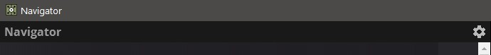
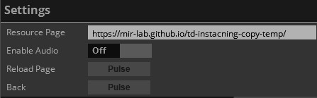
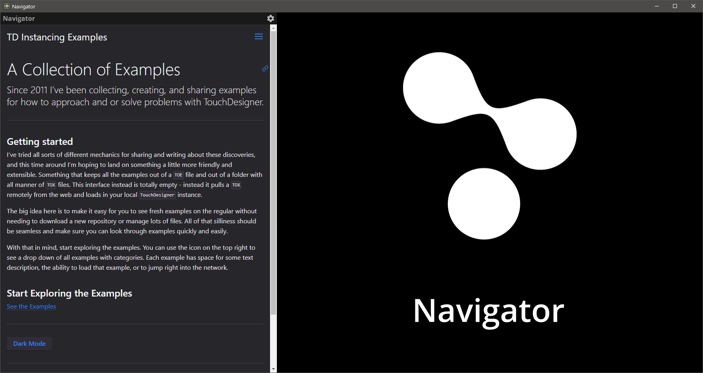
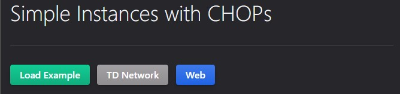

# TouchDesigner Instancing Examples
### Matthew Ragan & Zoe Sandoval ###
_[mir.works](http://mir.works)_ | _[matthewragan.com](http://matthewragan.com)_ | _[zoesandoval.com](https://www.zoesandoval.com/)_  

_Updated 07.06.21_

---
### Project Resource Link  
**https://mir-lab.github.io/touchdesigner-instancing-examples/**

Since 2011 I've been collecting examples for how to solve problems in TouchDesigner. Along the way I've built tox loaders, example networks, and all sorts of different ways for exploring educational content. Some of been a great success, others not so much. As I started to think about how to polish up some examples I wondered if I shouldn't rethink how I was handling these networks. 

This project is attempt to better approach some of those challenges. In this repo you'll only find the documentation that goes along with examples. This repo uses `just-the-docs` by @pmarsciell to keep a nice and tidy set of documentation that's used as a companion to a repo that loads remote toxes on demand. It's a different approach than I've used before, but it helps keep the learning tools simpler to navigate and lighter to download. The idea is that a TouchDesigner novice (or expert) shouldn't need to jump through lots of hoops to get to the interesting examples - as long as they have an internet connection, it should be as easy as clicking a button. 

# Getting Started
To view these examples you'll need to use the TouchDesigner Navigator.

You can find the [Navigator here](https://github.com/mir-lab/touchdesigner-resource-navigator).

Download the toe file from the `/release` directory. Or [click here.](https://github.com/mir-lab/touchdesigner-resource-navigator/raw/main/release/navigator.toe)

Once you've opened the Navigator, use the Gear icon located in the upper left of the documentation pane to view the project's settings:

Use the parameter `Resource Page` to set the target website for the navigator to use. Use the resource link listed in the project description for the navigator.

Once you've loaded a resource page, use the webpage on the left side of the interface to find and load examples.

While using the TouchDesigner Navigator you can `Load` remote TOX files, `Open` a floating TouchDesigner network, or open the same `Web` page in another browser:

Happy programming!

----

## Documentation Engine

### [Just the Docs](https://github.com/pmarsceill/just-the-docs)  
A modern, highly customizable, and responsive Jekyll theme for documentation with built-in search.

Easily hosted on GitHub Pages with few dependencies.

[See it in action!](https://pmarsceill.github.io/just-the-docs/)  

*If you're looking for a documentation tool to host on github pages, seriously check this out... it's amazing.*

